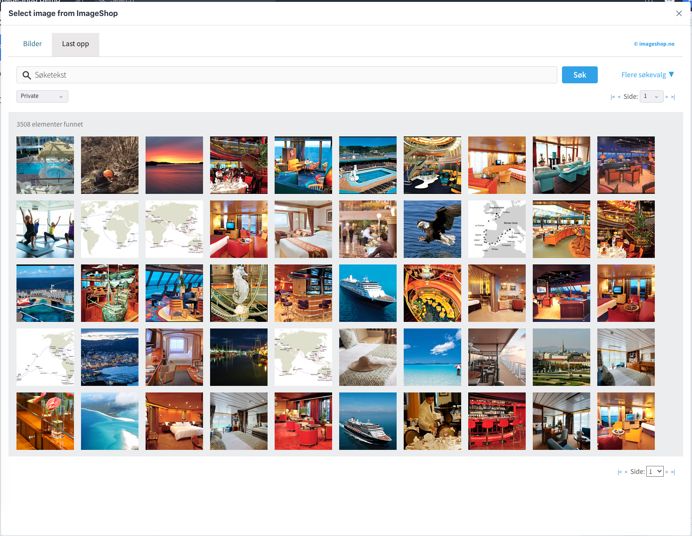

# Sanity Asset Source Plugin: ImageShop

Imageshop is a complete Digital Asset Management system (DAM system) for organizing and sharing images, videos and documents. This plugin integrates Imageshop image picker neatly into Sanity, so that you can access all your company's images inside Sanity CMS with only one click. You can also upload photos to Imageshop without leaving Sanity

## Installation

`sanity install @labs-tech/sanity-plugin-asset-source-imageshop`

Edit the config file found in your sanity project `./config/@labs-tech/sanity-plugin-asset-source-imageshop.json` with your Image shop token ("IMAGESHOPTOKEN").

You can find the credentials in the ImageShop Admin.

## Configuration

There are many ways to configure the interface for image selection.

All configuration can be found within `./config/@labs-tech/asset-source-imageshop.json`.

| Configuration key | Description |   Type         |   Default value   |
| ------------- | ------------- | ---------------- | ----------------- |
| **IMAGESHOPTOKEN**  | Required. Token to communicate with imageshop.  | string |  |
| IMAGE_MAX_SIZE  | Max size of the image returned from imageshop to sanity. Format: WxH |  string  |  2048x2048 |
| IMAGE_ALIAS  | Imageshop alias for permalink of image |  string  |  "Large" |
| IMAGESHOPINTERFACENAME  |  Standard interface used when searching images.  | string |  |
| IMAGESHOPDOCUMENTPREFIX  | Standrad document code prefix used when uploading images. |  string  |  |
| CULTURE  | Language for the client. Supports en-US and nb-NO. Norwegian is default (nb-NO) |  string  | "nb-NO" |
| PROFILEID  | 	Name of a profile, which has to be created by Screentek, which will return several different sizes and aspect ratios. IMAGESHOPSIZE can not be used together with a profile, and showing size dialogue or crop dialogue doens't make sence when using profiles. |  string  |  |
| REQUIREDUPLOADFIELDS  | String indicating upload fields which are required, separated by komma. Possible values: name, description, rights, credits, tags |  string  |  |
| UPLOADFIELDLANGUAGES  | List of languages which should be shown for name, description etc. Default = no,en. |  string  |  |
| SANITY_ASSET_TEXT_LANGUAGE | What language to store in sanity, from the title, description and credit fields | string | "no" |

## Part name

If you need to customize available asset sources, the plugin part name for this asset source is:

`part:sanity-plugin-asset-source-imageshop/image-asset-source`

## Developing on this module

To simulate using your development version as a real module inside a studio, you can do the following:

* Run `npm install && npm link` from the root of this repository.
* Run `npm run watch` to start developing and build the module when changes are made.

#### Displaying your development version inside a studio

**With the mono-repo's `test-studio`:**

  * Bootstrap the monorepo: `npm run bootstrap`
  * Add `@labs-tech/sanity-plugin-asset-source-imageshop` with the current version number to `package.json` in the `test-studio` root folder (but don't run `npm install` afterwards)
  * Run `npm link @labs-tech/sanity-plugin-asset-source-imageshop` inside the mono-repo's root.
  * Add `@labs-tech/sanity-plugin-asset-source-imageshop` to the list of the studios plugins in `sanity.json`.
  * Restart the `test-studio`

**With a regular Sanity Studio:**
  * Run `npm install`
  * Add `@labs-tech/sanity-plugin-asset-source-imageshop` with the current version number to `package.json`.
  * Run `npm link @labs-tech/sanity-plugin-asset-source-imageshop`
  * Add `@labs-tech/sanity-plugin-asset-source-imageshop` to the list of the studios plugins in `sanity.json`.
  * Start the studio

When you are done and have published your new version, you can run `npm unlink` inside this repo, and `npm unlink @labs-tech/sanity-plugin-asset-source-imageshop` inside the mono-repo or studio to get back to the normal state. Then run `npm run bootstrap` for the mono-repo or `npm install` inside the regular studio to use the published version.

## Futher reading
* https://www.imageshop.no/
* https://www.sanity.io/docs/custom-asset-sources
